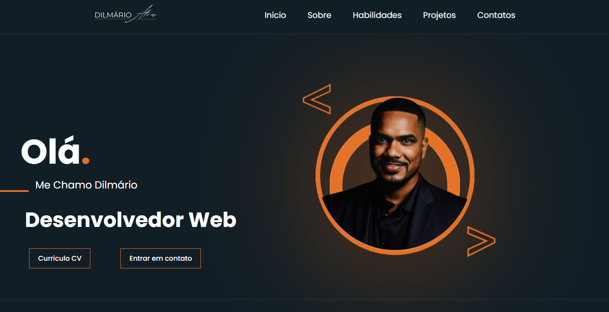

# Portfólio Pessoal – Dilmário Alves

Este é meu projeto de portfólio pessoal, desenvolvido para apresentar minhas habilidades, projetos e formas de contato de maneira profissional e responsiva.

## 💡 Sobre o Projeto

O objetivo é mostrar minhas competências como desenvolvedor, destacando projetos que desenvolvi e tecnologias que domino.


## 📸 Preview do Projeto




## 🛠️ Tecnologias Utilizadas

- HTML5  
- CSS3  
- JavaScript (Vanilla)  
- Font Awesome  
- Media Queries para responsividade  

## 📱 Design Responsivo

✅ Compatível com:
- Celulares  
- Tablets  
- Computadores  

---

## ⚙️ Funcionalidades

- Menu mobile com botão de abrir/fechar  
- Animações suaves  
- Links internos com rolagem suave  
- Cards de projetos com botão "Ver mais"  

## 🚀 Como Visualizar Localmente

1. Clone este repositório:
```bash
git clone https://github.com/seu-usuario/seu-portifolio.git
```

2. Abra o `index.html` no navegador.

---

## 🧠 Aprendizados

Com este projeto, evoluí nos seguintes tópicos:

- Responsividade com Media Queries  
- Posicionamento com Flexbox  
- Manipulação de DOM em JavaScript puro  
- Organização de layout mobile-first  

---

## 📬 Contato

- 👤 Dilmário Alves  
- 📧 dimarioalves_96@hotmail.com  
- 💼 [LinkedIn](https://www.linkedin.com/in/dilmario-alves-a06a8119b)  